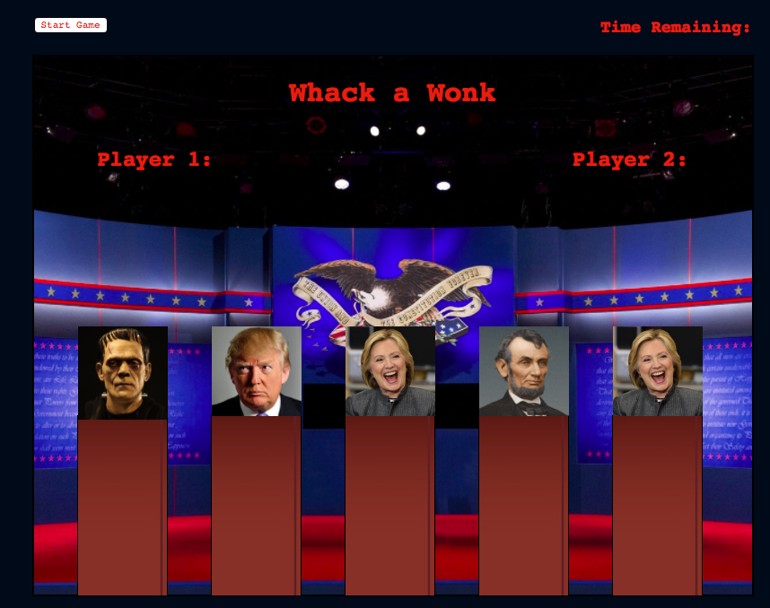

# Whack a Wonk

## The two-player game that gives you the chance to whack your favorite (err, least favorite) wonk.

<!--  -->

### Player 1 starts the game and gets their chance of 30 seconds to whack their favorite star of last season’s election drama. But be careful, whack the wrong one and lose some points!

## How to play:

### Use the mouse to whack with the friendly 'poo' emoji the Donald and HRC. Whichever player scores the most points, wins!

Play Whack a Wonk https://lshamos.github.io/Whack-a-Wonk/

## Development and Technologies
### Whack a Wonk was developed using HTML, CSS, JavaScript and the jQuery library.

## User stories:

-  When I arrive at the game I am prompted to start.

-  After I start I am quickly engrossed in whacking the wonks and am feeling a sense of relief.

-  I can play with another player and we can enjoy together.

-  Winning validates my quick reflexes.

-  After the game is over you can start a new one.

## MVP
-  Images that continually change during players turn.  
-  Multiple players.
-  Clickable images.
-  Game clock and image refresh rate.

## Dream features
-  Accelerating image rate as game progresses to end of time.
-  Images that pop up and down from podium.
-  Sounds for click.
-  Sounds for winner.
# Whack-a-Wonk
